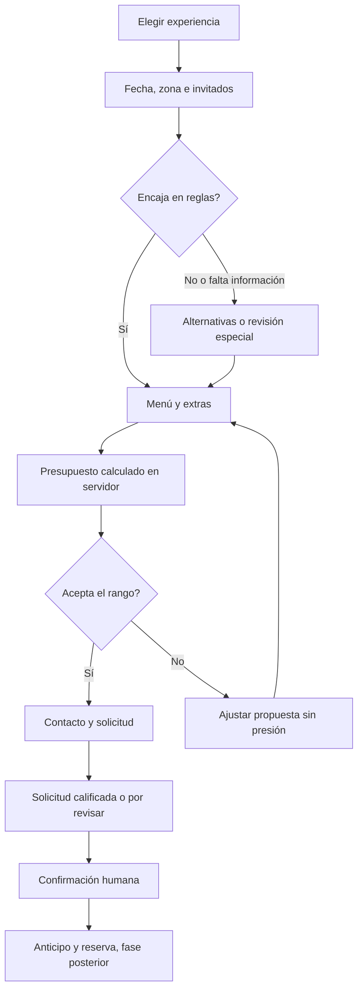

# Flujo comercial y precalificación

Flujo objetivo. En el MVP de tres semanas no se consulta disponibilidad real ni se verifica contacto por OTP: se revisan cobertura, anticipación y capacidad del menú; la fecha queda por confirmar y el contacto se valida por formato. Recuperación remota y agenda pertenecen a ampliaciones.

## Recorrido

1. **Inspiración:** experiencias y precios orientativos con inclusiones; CTA “Diseña tu evento”.
2. **Viabilidad:** tipo, fecha/franja, zona e invitados. Consultar bloqueos y reglas antes de pedir contacto.
3. **Inversión:** rango aproximado total o por persona, con opción “Necesito orientación”. Aclarar unidad y conceptos incluidos.
4. **Propuesta:** recomendar opciones compatibles, comparar hasta tres y mostrar por qué encajan. Nunca alterar precios según presupuesto declarado.
5. **Personalización:** elegir opciones permitidas de platillos, extras y servicios. Un evento = un carrito; invitados son cantidad global, no unidades independientes de cada plato.
6. **Logística:** características de cocina, acceso, horario y necesidades especiales según servicio. Dirección exacta solo cuando sea necesaria para la atención.
7. **Resumen:** total o rango, conceptos pendientes, vigencia, inclusiones y condiciones. Confirmación explícita “Este estimado está dentro de lo que considero invertir”.
8. **Contacto:** nombre y un canal de contacto; verificación por enlace/OTP si se requiere recuperar la propuesta. Consentimiento comercial separado del contacto solicitado.
9. **Solicitud:** guardar en servidor, generar folio y mostrar confirmación real; ofrecer WhatsApp con folio y resumen mínimo. Agradecimiento con plazo de respuesta acordado.
10. **Atención:** comercial recibe ficha completa, motivos de precalificación y siguiente acción. Confirma disponibilidad y emite propuesta final.

## Carrito de evento

Incluye menú base, cantidad de invitados, selección de platillos, extras por persona/unidad/evento y traslado. No mezclar dos fechas o lugares en el mismo presupuesto. Para otro evento, duplicar y recalcular.

Al cambiar de menú, conservar fecha, contacto e invitados; explicar y retirar los extras incompatibles. Al cambiar de fecha, zona o cantidades, recalcular y volver a solicitar aceptación del nuevo estimado. No reiniciar todo el formulario.

Borrador anónimo local: solo selecciones no sensibles y versión del catálogo. No guardar nombre, contacto ni restricciones alimentarias en localStorage. Recuperación entre dispositivos por sesión verificada, sin URLs públicas con datos personales.

## Reglas de enrutamiento

| Situación | Acción |
|---|---|
| Fuera de cobertura estándar | Ofrecer revisión de traslado, no total aparentemente cerrado |
| Fecha bloqueada | Ofrecer fechas alternativas o consulta excepcional; no prometer disponibilidad |
| Anticipación insuficiente | Revisión manual, según reglas aprobadas |
| Grupo fuera de límites del menú | Proponer menú adecuado o evento especial |
| Presupuesto inferior | Ajustar invitados/menú/extras y mostrar opciones reales; no esconder tarifas |
| Alergias o restricciones | Revisión por cocina; no asegurar ausencia de alérgenos automáticamente |
| Falta equipo de cocina o datos logísticos | Marcar pendiente, explicar motivo |
| Datos críticos y presupuesto aceptados | Prioridad comercial, aún sujeta a disponibilidad |

Siempre ofrecer una vía humana para excepciones. El filtrado reduce trabajo repetido; no elimina a quien pide orientación.

## Indicador interno de preparación — propuesta, no probabilidad

Solo información comercial declarada y requisitos del servicio. No usar identidad, características protegidas, salud, barrio como proxy de riqueza ni perfiles externos para valorar a una persona. Las restricciones alimentarias generan revisión técnica, no reducen la prioridad comercial.

| Criterio | Puntos sugeridos |
|---|---:|
| Fecha/franja y cobertura evaluadas | 20 |
| Invitados y paquete compatibles | 20 |
| Logística necesaria completa | 20 |
| Estimado vigente aceptado | 25 |
| Canal de contacto verificado | 15 |

80–100: lista para revisión comercial si cumple todos los criterios críticos; 50–79: completar información; menos de 50: orientación. Son umbrales iniciales para validar con el negocio, no calibración estadística. Mostrar razones y permitir corrección manual auditada. Un puntaje alto nunca evita un bloqueo de agenda ni una revisión de cocina.

**Implementación MVP:** usar etiquetas y lista de requisitos, sin puntaje numérico, porque no hay agenda ni verificación de contacto. Categorías: lista para revisión, faltan datos y requiere atención especial. Los pesos anteriores son una propuesta futura, no una función que deba implementarse ahora. No otorgar puntos de verificación o disponibilidad si no se comprobaron.

## Ficha que recibe el equipo

Folio, versión, estado, experiencia, fecha y horario local, invitados, zona, menú y extras; desglose y conceptos pendientes; aceptación del rango; información logística; contacto y consentimiento; alertas técnicas; responsable y próxima acción. Los detalles alimentarios quedan en zona restringida, no en métricas ni mensajes generales.

## Preguntas que la plataforma debe responder

Qué incluye y qué no; mínimo de personas; cobertura; necesidad de cocina/meseros; antelación; horarios y duración; proceso de confirmación; modificación y cancelación; facturación; adaptación de menús; diferencia entre estimado y reserva.

Cada respuesta sale de contenido aprobado por negocio. Si falta una respuesta, registrar la consulta para revisión en vez de inventarla.
