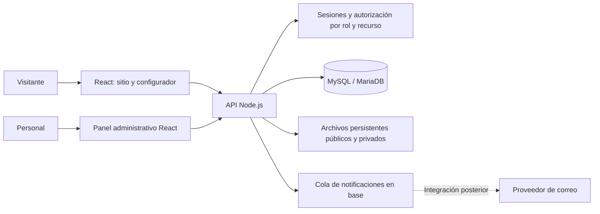

# Arquitectura actual: piloto Hostinger

## ADR-002 — React/Vite + Node.js + MySQL/MariaDB

Dirección acordada tras evaluar costos y reutilización para futuros clientes. Sustituye la recomendación ADR-001 de Supabase. El hosting todavía no está comprado y el backend no está implementado; ver `09-preparacion-local.md` para estado comprobado.

Se conserva la web React/TypeScript/Vite y se añade una API Node.js/TypeScript, una base MySQL/MariaDB y almacenamiento de imágenes persistente. El hosting administrado permite evitar gestionar un VPS al inicio. Versiones exactas, biblioteca de autenticación y controlador SQL se fijarán después de comprobar compatibilidad del entorno; no inventar que están instalados.

## Componentes

Monolito modular, una aplicación y una base por cliente. Reutilizar módulos, no mezclar registros de varios negocios en una base compartida. Producción y pruebas separadas. El servidor podrá servir el build estático de React y la API bajo un mismo origen para simplificar despliegue y sesiones.

## Módulos y ubicación objetivo

- `src/components`: presentación existente.
- `src/features`: catálogo, panel, solicitudes y configuración, al implementar cada módulo.
- `src/hooks/useQuoteDraft.ts`: estado de selección actual; contactos solo en memoria.
- `src/utils/quoteDraft.ts`: validación del borrador y cambios atómicos de menú.
- `server/`: API, sesiones, permisos, casos de uso y adaptadores.
- `shared/`: contratos y reglas puras compartidas cuando se extraiga el motor.
- `database/migrations/`: esquema, índices y restricciones versionados.
- `tests/`: regresiones existentes y futuras pruebas de integración/E2E.

No crear carpetas vacías ni reescribir toda la interfaz. Mantener la demo funcional durante la conexión progresiva al backend.

## Responsabilidades

El navegador selecciona y previsualiza. El servidor autoriza, valida y recalcula. La base garantiza integridad, unicidad y transacciones. No se traslada RLS de Supabase a MySQL: el aislamiento se aplica explícitamente en servicios y consultas autorizadas; cuenta DB de mínimos privilegios por aplicación.

Usar consultas parametrizadas y transacciones para publicar catálogo y emitir snapshots. Rechazar IDs desconocidos; nunca usar el primer menú como sustituto silencioso en la API. Guardar cantidades e importes en centavos con límites. Doble envío devuelve el mismo folio mediante idempotencia.

## Acceso y archivos

Sesiones mediante componente mantenido, cookie HttpOnly/Secure en producción, protección CSRF según método de sesión, límites de intentos y autorización en todos los endpoints privados. Sin registro público de administradores. Roles propietario/editor/comercial; no basta ocultar botones. Recuperación de cuenta mediante canal verificado. Secretos solo en servidor, nunca en `VITE_*` ni documentos.

Validar archivos por tamaño y tipo real, generar nombres seguros y conservar metadata. No permitir subir scripts/HTML ejecutable. Ubicar uploads fuera de carpetas que se sobrescriben al desplegar; verificarlo con una carga y un redespliegue. Borradores y documentos privados requieren autorización; solo medios publicados se sirven públicamente. Base de datos almacena rutas y metadata, no fotos como blobs por defecto.

## Publicación y operación

Borrador → validación → vista previa privada → publicación de revisión consistente. Cotizaciones emitidas inmutables y precios históricos preservados. La demo usa catálogo estático hasta que se implemente ese flujo.

API sensible y panel no se almacenan en caché público. Catálogo publicado e imágenes pueden usar caché/CDN. HTTPS, logs sin PII, backups de datos y medios, restauración ensayada y rollback del código. Hosting de prueba/producción con recursos separados según plan; no asumir Node ilimitado por sitios ilimitados.

Correo mediante outbox transaccional si se habilita; un fallo de correo no pierde una solicitud. Verificar soporte de tareas programadas del plan antes de elegir worker. Pagos y agenda automática fuera de primera entrega. SEO/pre-render público por resolver antes de publicación; panel y propuestas no indexables.

## Migración desde la demo

1. Conservar borrador y navegación (implementado).
2. Crear API de catálogo/estimación y base local con datos ficticios.
3. Implementar acceso y editor; publicación y pruebas de permisos.
4. Guardar solicitudes y snapshots; bandeja y filtro comercial.
5. Probar despliegue y persistencia en hosting comprado; lanzar solo después de QA y reglas reales aprobadas.

No hay datos alojados en Supabase que migrar en este proyecto. La elección anterior queda como antecedente, no como instrucción para crear servicios adicionales.

## Referencias verificadas durante la evaluación

- [Conexión Node.js con MySQL en Hostinger](https://www.hostinger.com/support/connecting-a-hostinger-mysql-database-to-a-node-js-application/).
- [Motor de base de datos de Hostinger](https://www.hostinger.com/support/1583226-which-database-management-system-is-used-at-hostinger/).
- [Límites del hosting](https://www.hostinger.com/support/6976044-parameters-and-limits-of-hosting-plans-in-hostinger/).

Verificar valores vigentes en el plan adquirido antes de desplegar; las capacidades documentadas no sustituyen la prueba de integración real.
