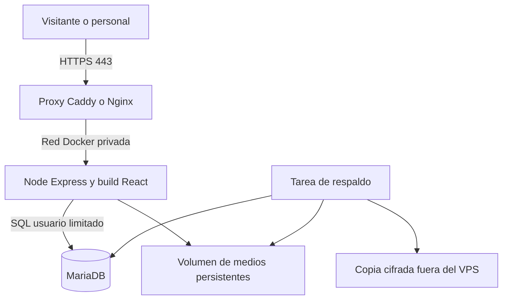

# Catering Oculto Plan de integración y entrega para Tony

Fecha de revisión: 1 de octubre de 2026. Destinatario: Tony, desarrollador encargado de la continuidad. Documento de análisis y propuesta; no es un despliegue ni una aprobación de reglas ambiguas.

## Decisión propuesta

Conservar React, TypeScript y Vite para la interfaz y extraer el backend Express existente a un servicio Node.js independiente. Ejecutar proxy HTTPS, aplicación y MariaDB mediante Docker Compose en un VPS Ubuntu de Hostinger. Reutilizar autenticación, catálogo editorial, motor, snapshots y bandeja; no reconstruirlos ni migrar de framework.

El objetivo de negocio es que el visitante entregue una solicitud con menú, platillos, invitados, zona y desglose calculado. El equipo debe resolver excepciones y confirmar la contratación, en lugar de reconstruir cada presupuesto por WhatsApp.

El documento del cliente permite sustituir gran parte del catálogo ficticio, pero exige ampliar el modelo de selección de platillos. No basta con cambiar cuatro precios en el panel actual. Tampoco basta con publicar el build: hoy omite las funciones premium que dependen de Vite dev.

## Fuentes y alcance de la revisión

- Fuente comercial: `C:/Users/GAMER/Downloads/catering%20oculto.docx`, leído directamente desde su contenido OOXML. No contiene imágenes incrustadas. Las referencias P corresponden a posiciones de párrafos del cuerpo, incluidos vacíos; no son páginas de Word.
- Código revisado: catálogo y configuraciones en `src`, motor y persistencia en `server`, migraciones 001 a 003, adaptador Vite, sesiones, bandeja y Compose actual.
- Se verificaron hoy regresiones de cálculo/editorial, reglas, tipos del servidor y build: pasan. La integración MariaDB documentada de sesiones/solicitudes/bandeja pasó en sesiones anteriores; no se volvió a ejecutar hoy ni se comprobó restauración sobre Docker.
- Docker Engine responde con versión 29.7.2 y Compose con 5.4.0. WSL lista Ubuntu detenido y docker-desktop en ejecución. Hay stacks ajenos activos. No se cambiaron ni reiniciaron.
- No se inspeccionó un VPS remoto ni se recibieron credenciales. Esta entrega modifica documentación, no tarifas publicadas ni datos de clientes.

## Lo que aporta el cliente

| Tema | Dato recibido | Efecto en el producto |
|---|---|---|
| Desayuno | $950 más IVA por persona; una opción elegida con anticipación (P1–18) | Producto de 95,000 centavos antes de impuestos; selección única; incluye fruta, yogurt griego, granola, miel, hot cakes y café |
| Lunch | $1,100 más IVA por persona (P20–42) | Producto de 110,000 centavos; alternativas que necesitan reglas de selección |
| Cena de dos tiempos | Entrada y fuerte por $1,300 más IVA (P44–46) | Producto propuesto de 130,000 centavos; confirmar que sea por persona |
| Cena de tres tiempos | Entrada, fuerte y postre por $1,450 más IVA (P44–46) | Producto propuesto de 145,000 centavos; confirmar unidad de cobro |
| Mínimo | 5 personas; menos se ve personalmente (P90–91) | Revisión manual, sin cobrar automáticamente cinco raciones |
| Cobertura | La Paz y localidades externas con costo extra (P92–95) | Dirección/localidad explícitas; definir alcance exacto de tarifa |
| Traslado | $5,000 por cada 20 personas (P94) | No automatizar hasta aclarar bloques, fracciones, zonas e impuestos |
| Anticipación | Un mes mínimo (P96–97) | Definir mes calendario o 30 días y si una excepción se rechaza o se revisa |
| Anticipo | 50% para reservar; saldo 15 días antes (P98–109, P129–130) | Mostrar condiciones; reservar solo tras comprobación humana del anticipo y aceptación |
| Reducciones | No ajustan costo ni generan reembolso (P101–103, P121–124) | Presupuesto contratado conserva invitados; cambios deben versionarse |
| Cancelación | Más de 30 días: posible devolución menos gastos; 15–30: anticipo no reembolsable; 7–14: retención de 75%; menos de 7: 100% (P110–120) | Política recibida para revisión y aceptación; no crear cobros o devoluciones automáticos |
| Reprogramación | Condiciones de 30 días, una vez, sujeta a disponibilidad; también se menciona aplicación del anticipo a otra fecha dentro de seis meses (P116, P125–128) | Resolver cómo conviven ambas cláusulas |

Moneda: el archivo usa el símbolo $, no declara MXN. El proyecto trabaja en MXN y ese contexto es consistente, pero debe confirmarse. “Más IVA” confirma que el importe base no lo incluye; no establece tasa, base gravable ni redondeo. No se ha inferido una tasa fiscal.

### Inventario de opciones para importar como borrador

- Desayunos: omelette; chilaquiles; croissant de huevo; tacos estilo Baja; sándwich de marlín ahumado. Chilaquiles tiene elecciones subordinadas de salsa roja/verde y huevo/pollo.
- Lunch: camarones al ajillo; pescado empanizado; tacos estilo Baja; mariscada; arrachera. Mariscada menciona bienvenida con ostiones y una lista marcada como opcional: aguachiles verde/negro/rojo, ceviche, tártara de atún y cóctel de frutos de mar. Cantidad de elecciones y suplementos no definidos.
- Cena: cuatro entradas (ceviche surf and turf, guacamole con pork belly, almejas de temporada, ensalada de vegetales ahumados); cuatro fuertes (pescado, filete, short rib, hamburguesa); cuatro postres (pay de “chocola”, tarta de dátil, flan, pay de limón). No crear opciones inexistentes para rellenar saltos de numeración.
- Conservar las descripciones recibidas como fuente y revisar ortografía culinaria antes de publicar. “Pay de chocola” y otras grafías requieren confirmación, no una reinterpretación silenciosa.
- No trasladar automáticamente maridajes, meseros adicionales, vajilla, barra de mezcal ni servicios incluidos de la demo: el Word no confirma esos precios o inclusiones. Tampoco inferir alérgenos seguros de una receta.

## Contraste con la implementación

| Área | Existe | Diferencia o trabajo necesario |
|---|---|---|
| Diseño | React/Vite, identidad aprobada, cotizador responsive | Conservar; adaptar pasos de comida/tiempos/platillos |
| Catálogo | Tres paquetes demo, importes y listas de tiempos fijos | Cuatro ofertas propuestas y opciones elegibles; fuente cliente versionada |
| Editor | Borrador/publicación/recuperación | `validateCatalog` fija longitud de listas e IDs a la plantilla; crear esquema versionado que permita altas/bajas sin romper referencias |
| Dinero | Centavos enteros, autoridad del servidor | Añadir desglose fiscal explícito y traslado por regla aprobada; navegador no debe mostrar un total definitivo distinto |
| Reglas | Anticipación en días, requisitos y vigencia con aprobación | Mes calendario no se representa; vigencia sigue sin dato del cliente y hoy solo es informativa |
| Solicitudes | Folio, snapshot, idempotencia y aceptación de versión | Añadir selección de platillos, versión de condiciones y estado de completitud del precio |
| Bandeja | Roles, responsable, notas, próxima acción y auditoría | Exponerla en producción y mostrar menú real y pendientes; no confundir cerrada con reservada |
| Autenticación | Argon2, sesiones SQL, roles por backend | Cookies HTTPS, origen configurable, bootstrap seguro, equipo/recuperación y pruebas tras proxy |
| Entrega | Build estático | `import.meta.env.DEV` oculta panel/guardado; API montada en plugin Vite y ligada a 127.0.0.1:5180 |
| Base de datos | MariaDB y tres migraciones | Ya existe SQL; falta migración reproducible a contenedor y ensayo de restauración |
| Operación | Compose solo para DB local, puerto 3307 | Falta imagen de app, proxy, salud, secretos, backups externos, despliegue y rollback |

Los máximos de 20/40/60 por menú y el tope técnico de 150 son de la demo. El Word no confirma capacidad máxima. No convertirlos en políticas reales por accidente.

## Arquitectura objetivo

Una aplicación modular es suficiente para este piloto. No se proponen microservicios, Kubernetes ni un cambio de framework. Node sirve la API y los estáticos compilados; Vite queda para desarrollo y build. Misma procedencia para sitio, panel y API reduce complejidad de cookies y CORS.

Propuesta de base: Ubuntu LTS compatible con Docker, Node 24 LTS y MariaDB 11.4 con parche mantenido. Antes de generar imágenes, fijar parches/digests y ejecutar integración sobre esas versiones. La versión exacta de Ubuntu local no se verificó; no se da por instalado un release específico. No trasladar archivos del datadir de MariaDB 10.4 a 11.4: exportación lógica, importación y validación.

Servicios Compose propuestos: `proxy`, `app`, `db` y ejecución puntual `migrate`. Proyecto independiente `catering-oculto`; redes y volúmenes exclusivos, sin `container_name` global. Publicar solo 80/443 en el VPS. No publicar 3306 ni el puerto interno de la API. En pruebas locales usar un puerto libre ligado a 127.0.0.1, elegido tras revisar colisiones; no reutilizar 3307 hasta aclarar si lo ocupa la instancia nativa.

Volúmenes separados para DB, medios y estado de certificados del proxy. No almacenar fotografías dentro de una imagen reemplazable. Backups fuera del VPS: un volumen Docker y un snapshot del proveedor por sí solos no sustituyen restauración verificada.

## Backend y contratos propuestos

Extraer `authApp` a una fábrica configurable e introducir un entrypoint que escucha el puerto de la app, valida configuración, comprueba DB y maneja apagado ordenado. Mantener un adaptador local sin duplicar lógica de negocio. Sustituir `/api/local-editor` por `/api/v1`, o mantener alias temporal documentado.

- Público: `GET /api/v1/catalog`, `POST /api/v1/quotes/estimate`, `POST /api/v1/quotes/submit`. Nunca enviar borradores al público.
- Personal: sesión/login/logout, catálogo editorial, medios, bandeja y equipo con permisos por endpoint y recurso.
- Imprimible: usar snapshot y lista explícita de campos públicos; no incluir notas, auditoría, asignaciones ni otros contactos. Acceso de personal autenticado y recibo del visitante en su sesión actual; no habilitar consulta pública solo por folio.
- Operación: `/health/live` y `/health/ready`, sin exponer configuración, SQL o secretos.

La selección enviada contiene IDs de oferta, platillos, variantes, zona, fecha e invitados. El servidor valida cardinalidad, temporada/disponibilidad editorial, compatibilidad y reglas. Importes, impuestos y descuentos enviados por el navegador no son autoridad.

Estimación: subtotal de menú, extras aprobados, traslado conocido, base fiscal y tasa confirmada, impuestos y total; cuando falta un componente, devolver total parcial y motivos, sin usar cero como sinónimo de desconocido. Calcular anticipo informativo en centavos solo sobre total definido; saldo = total menos anticipo para evitar diferencias de redondeo. No crear órdenes de pago en esta fase.

Versionar motor, catálogo y política. Cambio de versiones entre estimar y guardar devuelve conflicto y requiere aceptación nueva. Guardar snapshot completo y clave de idempotencia única; conservar replay del mismo payload aun si cambian precios después. Las correcciones posteriores generan una nueva versión relacionada, nunca reescriben una cotización emitida.

## Modelo de datos y migraciones

Conservar las tablas actuales: `editorial_state`, `editorial_audit`, `staff_users`, `staff_sessions`, `quote_requests`, `quote_followup`, `quote_activity` y `schema_migrations`.

Para salir a tiempo se recomienda mantener el catálogo como documento JSON validado y versionado en MariaDB. Añadir entidades lógicas de ofertas, grupos de selección, opciones y variantes dentro de ese documento. MariaDB sigue siendo la base SQL de persistencia; JSON no obliga a cambiar de motor. Normalizar todo el catálogo en tablas ahora ampliaría el trabajo sin una necesidad de consulta demostrada.

Cambios propuestos:

1. `schemaVersion` del catálogo y migrador v1→v2; listas dinámicas con IDs únicos, integridad de referencias y elementos inactivos. Publicación transaccional y control de revisión se conservan.
2. Tabla `catalog_releases` inmutable con ID/hash único, schemaVersion, documento, autor y fecha. Mantener estado de borrador/publicado y copiar releases al publicar. Los snapshots viejos siguen autocontenidos.
3. Ampliación del snapshot de solicitud: elecciones y nombres, desglose fiscal, componentes pendientes, política aceptada, hash y fecha de emisión. Compatibilidad de lectura con demo-v1/demo-v2.
4. Columnas de proyección indexadas para búsquedas frecuentes (fecha de evento, estado, responsable), si el volumen/consulta lo requiere; evitar rehacer todo como requisito del piloto.
5. Reservas, transacciones de pago y cancelaciones monetarias en una fase separada. Si se necesita registro manual, añadir estado explícito, actor y comprobación; nunca derivarlo automáticamente de un clic o de una nota.

Las migraciones DDL no deben depender de rollback transaccional en MariaDB. Diseñarlas reanudables, respaldar antes, aplicar con cuenta de migración y ensayar la recuperación de una ejecución parcial. La cuenta de app no debe administrar usuarios de DB ni eliminar bases.

## Seguridad y operación antes del VPS

- Sustituir guardas localhost por origen configurado, validación CSRF/origen para escrituras, HTTPS y cookies Secure/HttpOnly. Configurar confianza del proxy solo para el salto conocido y probar IP/límites de intentos.
- Cerrar bootstrap público: primera cuenta mediante comando administrativo controlado o token efímero fuera de la interfaz pública. No exponer `/auth/setup` libremente al estrenar el VPS.
- Secretos en archivos fuera de Git o mecanismos de secretos de Compose, con permisos restringidos. No incluir `.env.local`, backups ni medios privados en el contexto Docker. Compilar módulos nativos Argon2/Sharp dentro de Linux, no copiar `node_modules` de Windows.
- App sin root, DB privada, usuario limitado, imágenes fijadas, límites/rotación de logs. No registrar teléfonos, notas alimentarias, cookies ni contraseñas en logs.
- Política de retención y borrado aprobada por el negocio; solicitudes contienen datos personales. No se considera legalmente validada la política recibida por el simple hecho de importarla.
- Backups consistentes de DB y medios, copia externa cifrada, frecuencia/retención/RPO/RTO acordados. Propuesta inicial: diario y antes de migrar; validar su suficiencia con el responsable.
- Ensayar despliegue desde checkout limpio, restauración en base nueva y rollback de imagen compatible. Verificar puertos desde fuera: Docker puede eludir reglas UFW al publicar puertos; no asumir protección solo porque UFW esté activo.

## Preguntas concretas para cerrar con el cliente

1. ¿Todos los precios son MXN y ambas cenas son por persona? ¿Fecha de entrada en vigor y vigencia de una cotización?
2. ¿Cuál es la tasa de IVA aplicable y qué conceptos forman su base: menú, traslado y extras? Confirmar con su responsable fiscal; no deducirla del Word.
3. ¿$5,000 por cada 20 personas aplica dentro de La Paz, fuera o a ambos? ¿21 personas pagan dos bloques? ¿5 pagan bloque completo? ¿Se suma otro cargo por localidad? ¿Incluye IVA?
4. ¿Un mes equivale a 30 días o al mes calendario anterior? ¿Solicitudes tardías se atienden como excepción?
5. ¿Una opción de desayuno es para todo el grupo? En lunch y cena, ¿se elige una opción por tiempo para todos, o puede haber menús distintos? ¿Qué incluye mariscada y cuántas opciones permite?
6. ¿Qué capacidad máxima, servicios, bebidas, equipo y personal están incluidos? ¿Hay suplementos en platillos o ajustes dietarios?
7. ¿Incrementos de invitados requieren 30 días, o pueden admitirse hasta la confirmación final a 15 días? El texto contiene ambas referencias sin resolver el caso intermedio.
8. ¿Cómo convive reprogramar dentro de seis meses tras cancelar a 15–30 días con la prohibición de cambios a menos de 30 días? ¿La retención de 75% implica saldo adicional si solo se pagó 50%?
9. ¿Quién verifica anticipos y disponibilidad, quién aprueba condiciones/privacidad y quién responde solicitudes? ¿Dominio, fotos propias y contacto definitivo?

Hasta recibir respuesta: precios inequívocos como borrador, traslado/impuestos como pendientes, menos de cinco a revisión, sin cargos, devoluciones ni reservas automáticos.

## Plan de ejecución y aceptación

Estimación inicial de ingeniería, no compromiso contractual. Una persona con foco, reutilizando lo existente; revisar al cerrar ambigüedades. El plazo original de tres semanas no permite deducir una nueva fecha de entrega. Confirmar fecha vigente antes de prometerla.

| Orden | Entregable | Esfuerzo orientativo | Criterio de aceptación |
|---|---|---|---|
| 1 | Baseline Git y matriz de decisiones | 4–6 h | Commit inicial revisado sin secretos; fuente trazable y reglas pendientes explícitas |
| 2 | API independiente y build premium | 10–16 h | Build real sirve panel, catálogo y solicitudes sin Vite; roles y cookies probados |
| 3 | Catálogo v2 y elecciones culinarias | 12–20 h | Ofertas reales en borrador; cardinalidad/variantes válidas; migración conserva snapshots |
| 4 | Motor de impuestos, traslado y condiciones | 8–14 h | Casos aprobados calculados exactamente; desconocidos parciales; aceptación invalida al cambiar versión |
| 5 | Resumen imprimible y cierre comercial | 6–10 h | Folio/desglose idénticos al snapshot; sin notas internas; seguimiento operativo |
| 6 | Compose y ensayo Linux aislado | 8–12 h | App+DB+proxy reproducibles; volumen de medios; migración e integración reales |
| 7 | QA final, recuperación y transferencia | 10–16 h | Móvil/teclado, E2E, restauración, manual y recorrido completo con Tony |

Total orientativo: 58–94 horas, sin espera de respuestas ni infraestructura, y sin pagos/bot/agenda. Equipo y recuperación de contraseña pueden ampliar el rango según alcance acordado. Primero ejecutar 1 y 2; diseñar 3 mientras llegan respuestas; no bloquear la extracción del backend por ambigüedades del traslado.

Pruebas mínimas: IDs alterados, selecciones faltantes o incompatibles, grupos 4/5 y límites aprobados, traslado 19/20/21 cuando se defina, fechas en cierre de mes/bisiesto y zona del negocio, redondeo fiscal, doble submit concurrente, cambio de precio/política, permisos por rol, medios privados, salida de sesión, importación desde catálogo viejo, imprimible sin datos internos y restauración completa.

## Transferencia a Tony

Entregar repositorio con remoto y rama principal, lockfile, mapa de módulos, `.env.example` sin secretos, Dockerfiles/Compose, comandos de build/migración/pruebas, matriz comercial aprobada, respaldos/restauración y registro de decisiones. Accesos por canal seguro y cuentas individuales, con responsabilidades de dominio, VPS, backups y soporte definidas.

Recorrido de aceptación: editar catálogo → publicar → configurar platillos → calcular → guardar una sola solicitud → revisar en bandeja → imprimir → registrar seguimiento. Segundo recorrido: reinstalar desde cero con backup y comprobar el mismo folio y snapshot.

No se necesitan contraseñas para el siguiente ticket local. Para el despliegue sí hará falta inventario del VPS, dominio y acceso SSH mediante el mecanismo seguro que acuerden. SQL es el lenguaje; MariaDB es el motor. Ya tenemos backend y DB locales: el trabajo pendiente es completar el modelo comercial y convertirlos en una aplicación desplegable y operable.

## Referencias técnicas consultadas

- Node.js y versiones LTS: https://nodejs.org/en/about/previous-releases
- Docker Engine sobre Ubuntu: https://docs.docker.com/engine/install/ubuntu/
- Publicación y exposición de puertos: https://docs.docker.com/engine/network/port-publishing/
- MariaDB y política de mantenimiento: https://mariadb.org/about/

Las versiones mayores propuestas se contrastaron con estas fuentes el 1 de octubre de 2026. Seleccionar parches exactos al implementar y conservarlos en la entrega reproducible.
